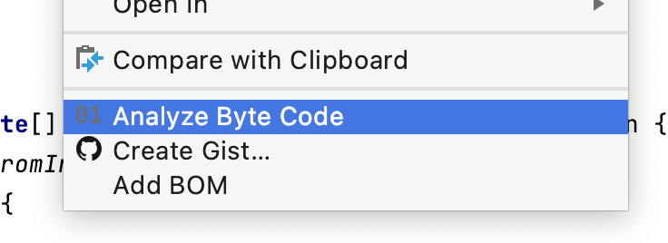
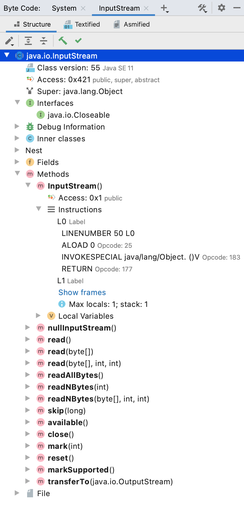
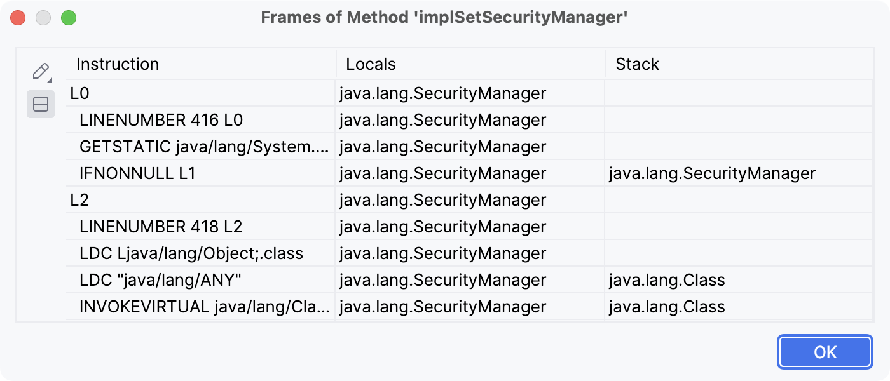
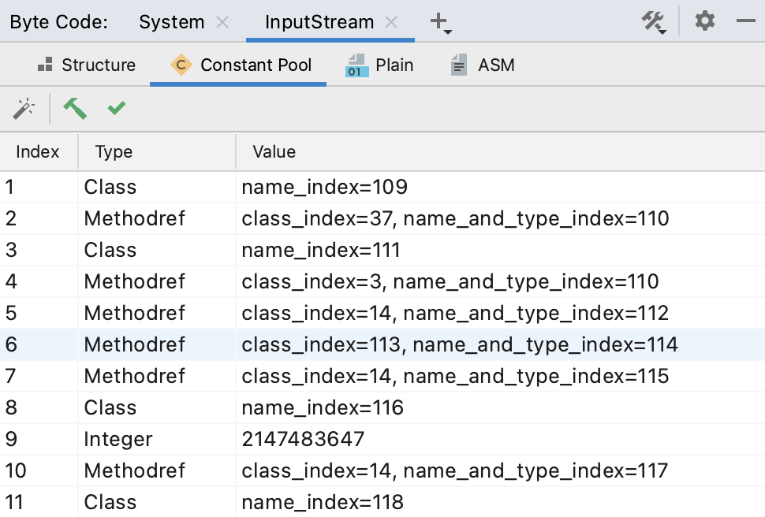
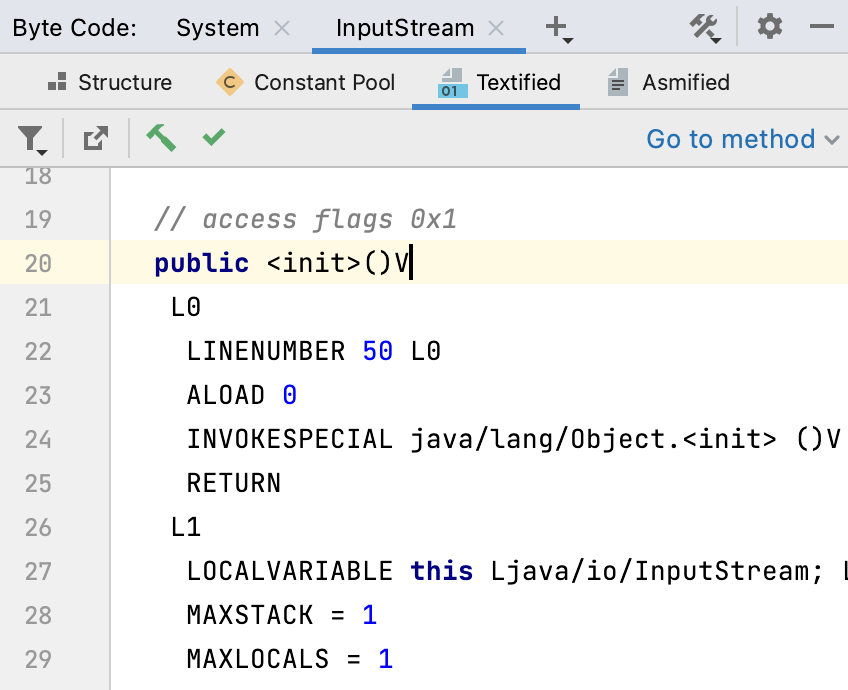
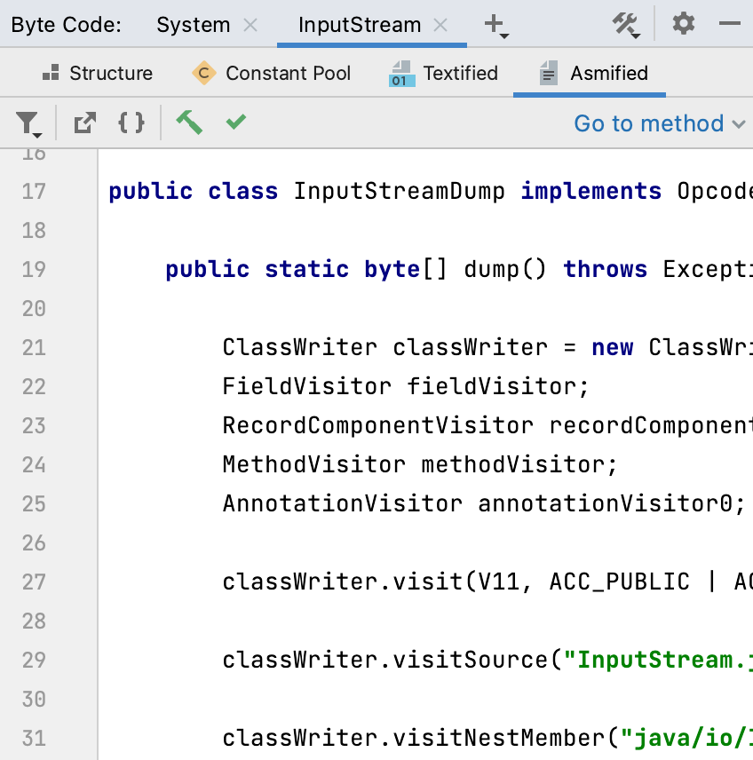
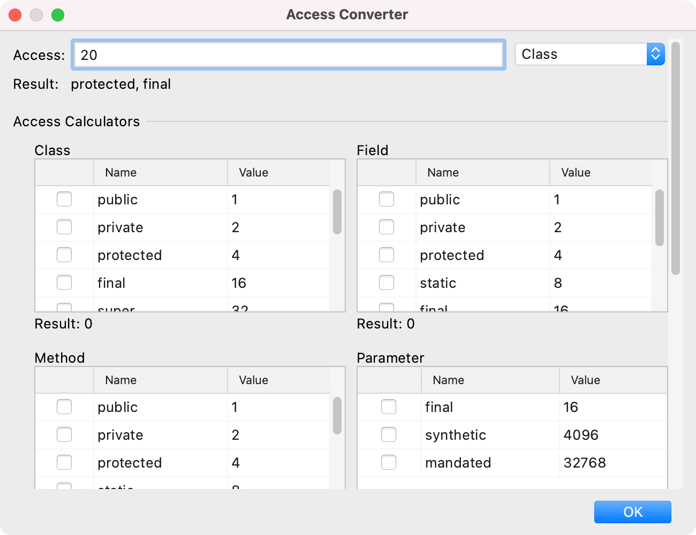
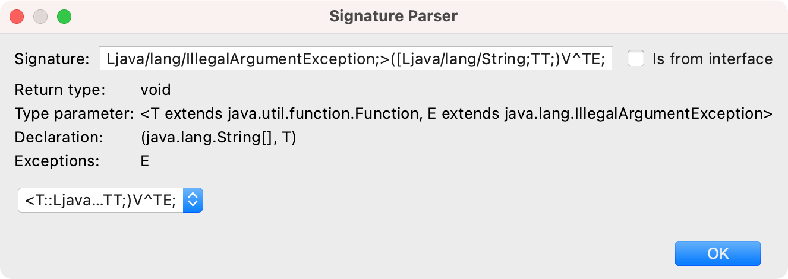
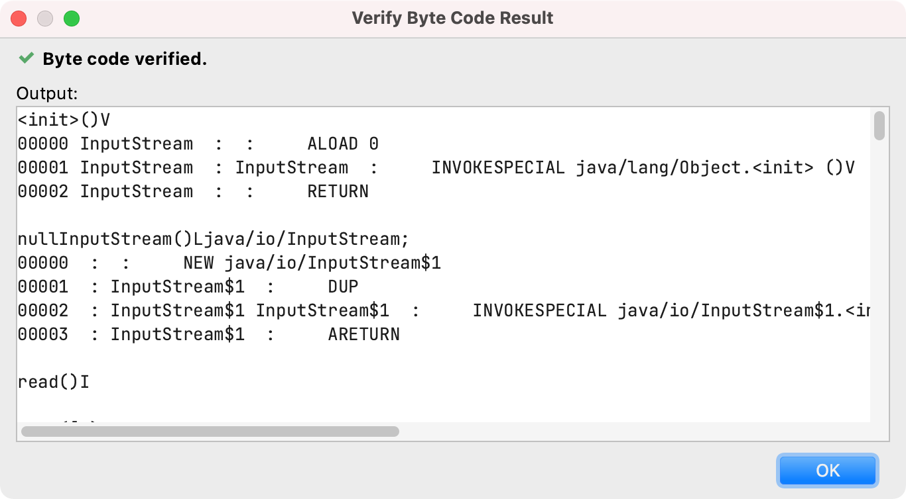

# IntelliJ Byte Code Analyzer Plugin

This IntelliJ plugin provides a modern and powerful byte code analyzer tool window. Its supports Java, Kotlin, Groovy and other JVM language class files.

[**It's available on the official IntelliJ plugin marketplace**](https://plugins.jetbrains.com/plugin/16970-byte-code-analyzer).

The tool window is available via *View | Tool Windows | Byte Code* and will be shown by default in the lower right corner of IntelliJ.

Class files can be either opened directly from the tool window or from the "Analyze Byte Code" action. This action is available in the project view and in the editor for JVM class or source files:

If the action is executed from the editor, the class relative to the current cursor position will be selected. This makes it easy to analyse inner, locale or anonymous classes.

The plugin currently uses [ASM 9.1](https://asm.ow2.io) under the hood, which supports JVM class files up to version 16.

## Features

### Structure View

The heart of the tool window is the structure view of a class file. It gives a quick and detailed tree overview of the individual components of a class file:

In addition to listing the method instructions, the state of the method frames can be viewed after each instruction:

### Constant Pool View

This view provides insights into the constant pool entries of the class file:

### Plain View

The plain view provides a textified representation of the byte code:

### ASM View

The ASM view provides Java source code that contains all instructions to generate the class via the [ASM](https://asm.ow2.io) library:

### Byte Code Tools

Some generic byte code tools are provided via the menu in the upper right corner of the tool window. These are providing a general way to better understand certain aspects of the byte code specification. 

#### Access Converter

The access values are stored in a compressed single number in the byte code. With the help of the access converter tool, this number can be broken down into readable single values, and a compressed one can be calculated:

#### Signature Parser

With the help of the signature parser a signature string can be broken down into its components:

## Other

Additionaly, there is an action to verify the byte code of a class file:

## Development

In general all packages starting with an underscore `_` are seen as internal. The code in those packages is not intended to be used by other plugins and do not necessarily adhere to the semantics version rules.

If you want to contribute something, please follow the code style in the `.editorconfig` and sign your commits.

### Update ASM / add new Java version

To update the bundled ASM, set the new version in the main `build.gradle.kts`. The new bundled ASM library should automatically be created, or execute the Gradle task `shadowAsmJar`. The ASM API version is defined globally in the variable: `dev.turingcomplete.intellijbytecodeplugin._ui.DefaultClassFileContext.ASM_API`. Also the new version must be set in the description block of the `plugin.xml` and in the `README.md`.

New Java versions must be added to the field `dev.turingcomplete.intellijbytecodeplugin.bytecode.ClassVersionUtils.CLASS_VERSIONS`.

### Extension Points

#### Open Class Files Action

Open class files actions (e.g., the "open from disk" action) offer a way to read class files and open are new tab in the tool window.

* Extension name: `dev.turingcomplete.intellijbytecodeplugin.openClassFilesAction`
* Interface: `dev.turingcomplete.intellijbytecodeplugin.openclassfiles.OpenClassFilesToolWindowAction`

To open a class file in the byte code analyzer tool window, propagate the file via the topic `dev.turingcomplete.intellijbytecodeplugin.openclassfiles.OpenClassFilesListener$OPEN_CLASS_FILES_TOPIC`.

#### Byte Code Tool

The byte code tools do not directly refer to an opened class file (use a byte code action for that).

* Extension name: `dev.turingcomplete.intellijbytecodeplugin.byteCodeTool`
* Interface: `dev.turingcomplete.intellijbytecodeplugin.tool.ByteCodeTool`

#### Byte Code View

Byte code views (e.g., the structure view) display a representation of the byte code.

* Extension name: `dev.turingcomplete.intellijbytecodeplugin.byteCodeViewCreator`
* Interface: `dev.turingcomplete.intellijbytecodeplugin.view.ByteCodeView$Creator`

#### Byte Code Action

Byte code actions (e.g., the decompile action) will be added to each byte code view toolbar. The refere to the currently opened class file.

* Extension name: `dev.turingcomplete.intellijbytecodeplugin.byteCodeAction`
* Interface: `dev.turingcomplete.intellijbytecodeplugin.view.ByteCodeAction`

### Tests

There are some tests that are testing the parsing of the structure tree and the constant pool and the opening of files with all class files from the java.base module and from the groovy-all kotlin-stdlib libraries. Since this involves tens of thousands of files, these tests take a lot of time. Therefore, execution in `dev.turingcomplete.intellijbytecodeplugin.ClassFileConsumerTestCase.LIMIT_CLASSES` is limited to 800 class per library. When a new version is to be released it is advisable that this value should be increased significantly for a test run.

## Planned Features

- Detailed byte code instructions overview.
- Make texts translatable.

## License

Copyright (c) 2021 Marcel Kliemannel

Licensed under the **Apache License, Version 2.0** (the "License"); you may not use this file except in compliance with the License.

You may obtain a copy of the License at <https://www.apache.org/licenses/LICENSE-2.0>.

Unless required by applicable law or agreed to in writing, software distributed under the License is distributed on an "AS IS" BASIS, WITHOUT WARRANTIES OR CONDITIONS OF ANY KIND, either express or implied. See the [LICENSE](./LICENSE) for the specific language governing permissions and limitations under the License.
