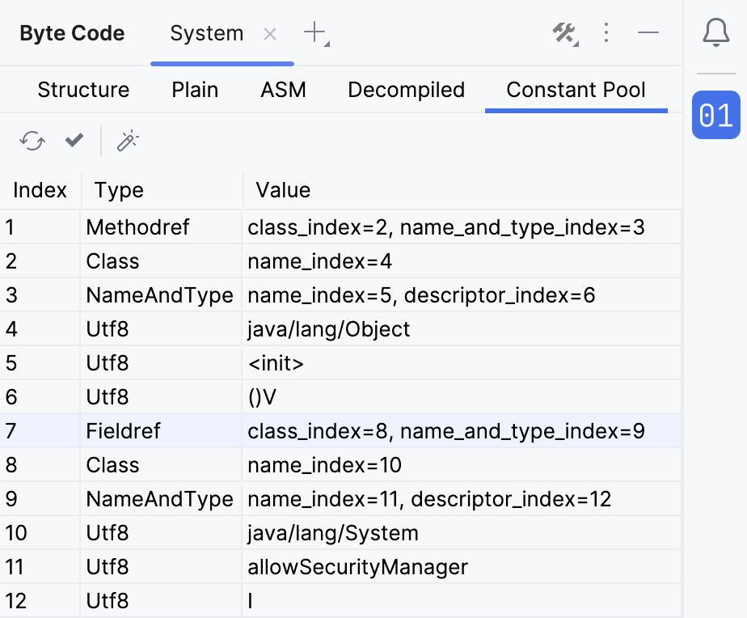
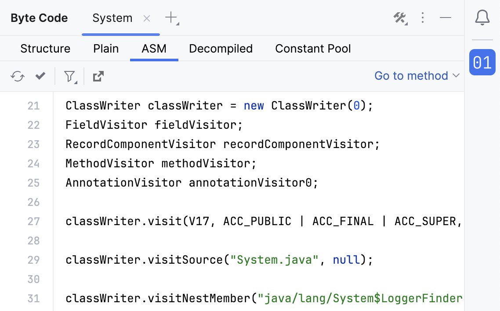
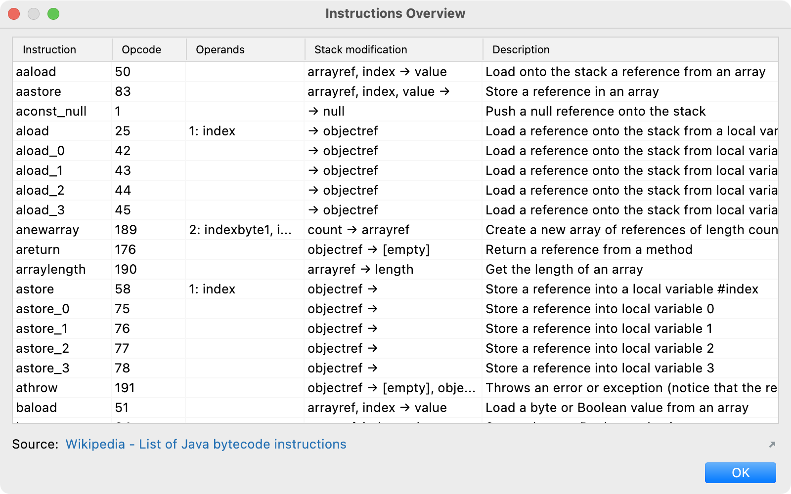

# IntelliJ Byte Code Analyzer Plugin

This IntelliJ plugin provides a modern and powerful tool window to analyze byte code. Its supports Java, Kotlin, Groovy, and other JVM language class files.

[**It's available on the official IntelliJ plugin marketplace**](https://plugins.jetbrains.com/plugin/16970-byte-code-analyzer).

The tool window is available via *View | Tool Windows | Byte Code* and will be shown by default in the lower right corner of IntelliJ.

Class files can be opened directly from the tool window or the "Analyze Byte Code" action. This action is available in the project view and the editor for JVM class or source files:

If the editor is the origin of the action execution, the analyzer will pick the class relative to the current cursor position. With this, it is easy to analyze inner, locale, or anonymous classes.

The plugin currently uses [ASM 9.4](https://asm.ow2.io) under the hood, supporting JVM class files up to version 19.

## Features

### Structure View

The heart of the tool window is the structure view of a class file. It gives a depth and human-readable insights into the individual elements of a given class file:

In addition to listing the method instructions, we can view the state of the method frames (locals and current stack) after the execution of each instruction:

### Constant Pool View

This view provides insights into the constant pool entries of the class file:

### Plain View

The plain view provides a textified representation of the byte code:

### ASM View

The ASM view provides Java source code that contains all instructions to generate the class via the [ASM](https://asm.ow2.io) library:

### Byte Code Tools

The menu in the upper right corner of the tool window provides some generic byte code analyzing actions. These are providing a general way better to understand certain aspects of the byte code specification.

#### Access Converter

The byte code stores access values in a single compressed number. With the help of the access converter tool, we can break this number into single readable values or calculate a compressed one:

#### Signature Parser

With the help of the signature parser, we can split a signature string into its components:

#### Instructions Overview

A built-in overview of all byte code instructions, with name, opcode, operands, stack modifications and a description:

## Other

Additionally, there is an action to verify the byte code of a class file:

## Development

In general, all packages starting with an underscore `_` are internal. Therefore, the code in those packages is not intended to be used by other plugins and does not necessarily adhere to the semantics version rules.

If you want to contribute something, please follow the code style in the `.editorconfig` and sign your commits.

### Update ASM / add new Java version

To update the bundled ASM library:

- Set the new version in the main `build.gradle.kts`. (The new bundled ASM library should automatically be created or execute the Gradle task `shadowAsmJar`.)
- Update the globally defined ASM API version in: `dev.turingcomplete.intellijbytecodeplugin._ui.DefaultClassFileContext.ASM_API`.
- Set the new version in the description block of the `plugin.xml` and in the `README.md`.
- New supported  Java versions must be added to the field: `dev.turingcomplete.intellijbytecodeplugin.bytecode.ClassVersionUtils.CLASS_VERSIONS`.

### Extension Points

#### Open Class Files Action

Open class files actions (e.g., the "open from disk" action) offer a way to read class files and open are new tab in the tool window.

* Extension name: `dev.turingcomplete.intellijbytecodeplugin.openClassFilesAction`
* Interface: `dev.turingcomplete.intellijbytecodeplugin.openclassfiles.OpenClassFilesToolWindowAction`

To open a class file in the byte code analyzer tool window one of the methods in the service `project.getService(ByteCodeToolService::class.java)` can be called.

#### Byte Code Tool

The byte code tools do not directly refer to an opened class file (use a byte code action for that).

* Extension name: `dev.turingcomplete.intellijbytecodeplugin.byteCodeTool`
* Interface: `dev.turingcomplete.intellijbytecodeplugin.tool.ByteCodeTool`

#### Byte Code View

Byte code views (e.g., the structure view) display a representation of the byte code.

* Extension name: `dev.turingcomplete.intellijbytecodeplugin.byteCodeViewCreator`
* Interface: `dev.turingcomplete.intellijbytecodeplugin.view.ByteCodeView$Creator`

#### Byte Code Action

Byte code actions (e.g., the decompile action) will be added to each byte code view toolbar. They are working with the currently opened class file.

* Extension name: `dev.turingcomplete.intellijbytecodeplugin.byteCodeAction`
* Interface: `dev.turingcomplete.intellijbytecodeplugin.view.ByteCodeAction`

### Tests

Some tests are testing the parsing of the structure tree and the constant pool and the opening of files with all class files from the java base module and the `groovy-all` and `kotlin-stdlib` libraries. Since this involves tens of thousands of files, these tests take a lot of time. Therefore, execution in `dev.turingcomplete.intellijbytecodeplugin.ClassFileConsumerTestCase.LIMIT_CLASSES` is limited to 800 classes per library. This value should be increased significantly for at least one test run before a new version gets released.

## License

Copyright (c) 2022 Marcel Kliemannel

Licensed under the **Apache License, Version 2.0** (the "License"); you may not use this file except in compliance with the License.

You may obtain a copy of the License at <https://www.apache.org/licenses/LICENSE-2.0>.

Unless required by applicable law or agreed to in writing, software distributed under the License is distributed on an "AS IS" BASIS, WITHOUT WARRANTIES OR CONDITIONS OF ANY KIND, either express or implied. See the [LICENSE](./LICENSE) for the specific language governing permissions and limitations under the License.
